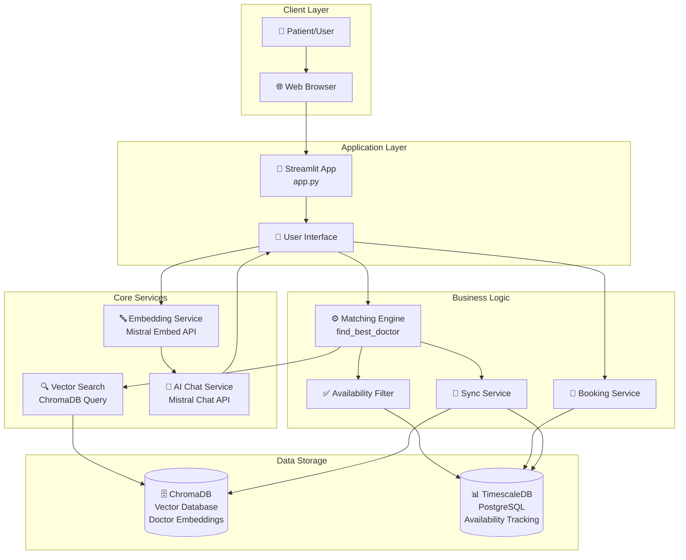
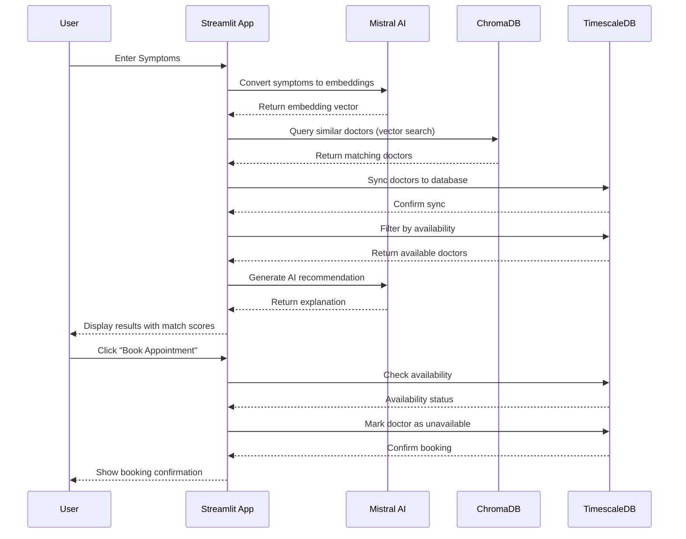
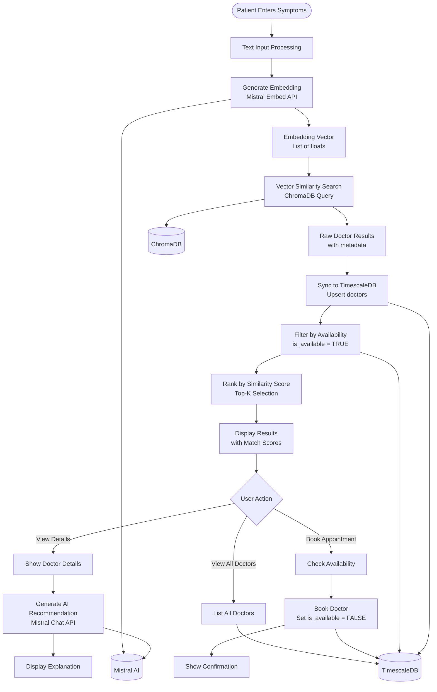

# MediMatch AI - Symptom-Based Doctor Matching AI Agent

A web application that matches patients with doctors based on symptoms using Mistral AI embeddings and ChromaDB vector search.

## Setup

1. Install dependencies:
```bash
pip install -r requirements.txt
```

2. Configure environment variables:
   - Copy `.env.example` to `.env`:
     ```bash
     cp .env.example .env
     ```
   - Edit `.env` and add your API keys and configuration:
     - `MISTRAL_API_KEY`: Your Mistral AI API key
     - `CHROMA_API_KEY`: Your ChromaDB API key
     - `CHROMA_TENANT`: Your ChromaDB tenant ID
     - Other configuration values (optional, defaults provided)

3. Run the application:
```bash
streamlit run app.py
```

The application will open in your browser at `http://localhost:8501`

## Features

- **Symptom-based matching**: Enter patient symptoms and find the best matching doctor
- **Vector similarity search**: Uses Mistral embeddings to find semantically similar doctors
- **AI recommendations**: Get AI-powered explanations for doctor recommendations
- **Doctor availability tracking**: TimescaleDB integration to track doctor availability
- **Appointment booking**: Book appointments and automatically mark doctors as unavailable
- **Multiple results**: View top-k matching doctors with similarity scores
- **Visual match scores**: Color-coded match indicators
- **Database management**: View and manage all doctors in the system

## System Architecture

### High-Level Architecture



### Component Interaction Flow



### Data Flow Diagram



### Component Details

#### 1. **Frontend Layer (Streamlit)**
- **File**: `app.py`
- **Responsibilities**:
  - User interface rendering
  - User input collection
  - Result display with visual indicators
  - Interactive booking interface
  - Database management UI

#### 2. **AI Services**
- **Mistral AI Embedding Service**:
  - Converts patient symptoms to high-dimensional vectors
  - Model: `mistral-embed` (configurable)
  - Returns: 1024-dimensional embedding vector
  
- **Mistral AI Chat Service**:
  - Generates natural language recommendations
  - Model: `mistral-small-latest` (configurable)
  - Provides explanations for doctor matches

#### 3. **Vector Database (ChromaDB)**
- **Purpose**: Stores doctor embeddings and metadata
- **Collection**: `doctor_embeddings` (configurable)
- **Data Structure**:
  - `id`: Unique doctor identifier
  - `embedding`: Vector representation of doctor speciality
  - `metadata`: Doctor name, speciality, etc.
- **Operations**: Vector similarity search (cosine distance)

#### 4. **Relational Database (TimescaleDB)**
- **Purpose**: Tracks doctor availability and appointments
- **File**: `database.py`
- **Schema**: `doctors` table
  - `id`: Primary key
  - `doctor_name`: Unique identifier
  - `speciality`: Medical speciality
  - `chroma_id`: Reference to ChromaDB
  - `is_available`: Availability status (boolean)
  - `created_at`, `updated_at`: Timestamps
- **Connection Pool**: Thread-safe connection pooling (1-5 connections)

#### 5. **Core Business Logic**
- **Matching Engine** (`find_best_doctor`):
  - Queries ChromaDB with symptom embedding
  - Retrieves top-k candidates (3x requested for filtering)
  - Filters by availability
  - Returns ranked results
  
- **Sync Service** (`sync_doctors_from_chroma`):
  - Syncs doctors from ChromaDB to TimescaleDB
  - Upsert operation (insert or update)
  - Maintains data consistency
  
- **Availability Filter** (`get_available_doctors`):
  - Queries TimescaleDB for available doctors
  - Filters search results in real-time
  - Fail-safe: Returns all if DB unavailable
  
- **Booking Service** (`book_doctor`):
  - Atomic booking operation
  - Sets `is_available = FALSE`
  - Prevents double-booking with WHERE clause check

### System Flow Summary

1. **Initialization**:
   - Load environment variables from `.env`
   - Initialize Mistral AI client
   - Connect to ChromaDB cloud instance
   - Initialize TimescaleDB connection pool
   - Create database schema if needed

2. **Search Process**:
   - User enters symptoms → Text input
   - Symptoms → Embedding vector (Mistral)
   - Vector → Similar doctors (ChromaDB)
   - Doctors → Sync to TimescaleDB
   - Filter → Only available doctors
   - Rank → By similarity score
   - Display → Top-k results with scores

3. **Booking Process**:
   - User clicks "Book Appointment"
   - Check availability (TimescaleDB)
   - If available → Update `is_available = FALSE`
   - Show confirmation
   - Refresh UI

4. **AI Recommendation**:
   - Generate explanation (Mistral Chat)
   - Display in expandable section
   - Optional feature (can be toggled)

### Technology Stack

| Layer | Technology | Purpose |
|-------|-----------|---------|
| **Frontend** | Streamlit | Web UI framework |
| **AI Embeddings** | Mistral AI | Text-to-vector conversion |
| **AI Chat** | Mistral AI | Natural language generation |
| **Vector DB** | ChromaDB Cloud | Semantic search storage |
| **Relational DB** | TimescaleDB (PostgreSQL) | Availability tracking |
| **Language** | Python 3.13 | Backend logic |
| **Database Driver** | psycopg2-binary | PostgreSQL connection |
| **Environment** | python-dotenv | Configuration management |

## How it works

1. Patient enters symptoms
2. Symptoms are converted to embeddings using Mistral Embed API
3. Vector similarity search in ChromaDB finds matching doctors
4. **Database filters results** to show only available doctors
5. Results are ranked by similarity score
6. Patient can book an appointment, which marks the doctor as unavailable
7. AI generates recommendation explanation (optional)

## Configuration

API keys and database credentials are stored in the `.env` file (not committed to git for security). 
- Copy `.env.example` to `.env` and fill in your actual credentials
- The `.env` file is automatically ignored by git (see `.gitignore`)
- Required variables: `MISTRAL_API_KEY`, `CHROMA_API_KEY`, `CHROMA_TENANT`
- Optional variables have defaults: `CHROMA_DATABASE`, `COLLECTION_NAME`, `EMBEDDING_MODEL`, `CHAT_MODEL`
- **Database connection**: `DB_CONNECTION` (defaults to TimescaleDB connection string)

## Database Setup

The system uses **TimescaleDB** (PostgreSQL) to track doctor availability:

1. **Database Schema**: The `doctors` table is automatically created on first run
2. **Initialization**: Run `python init_database.py` to manually initialize the schema (optional, auto-initializes on app start)
3. **Doctor Sync**: Doctors are automatically synced from ChromaDB to TimescaleDB when searched
4. **Availability**: Only available doctors are shown in search results
5. **Booking**: When a patient books an appointment, the doctor is marked as unavailable

### Database Schema

```sql
CREATE TABLE doctors (
    id SERIAL PRIMARY KEY,
    doctor_name VARCHAR(255) NOT NULL UNIQUE,
    speciality VARCHAR(255) NOT NULL,
    chroma_id VARCHAR(255),
    is_available BOOLEAN DEFAULT TRUE,
    created_at TIMESTAMP DEFAULT CURRENT_TIMESTAMP,
    updated_at TIMESTAMP DEFAULT CURRENT_TIMESTAMP
);
```


